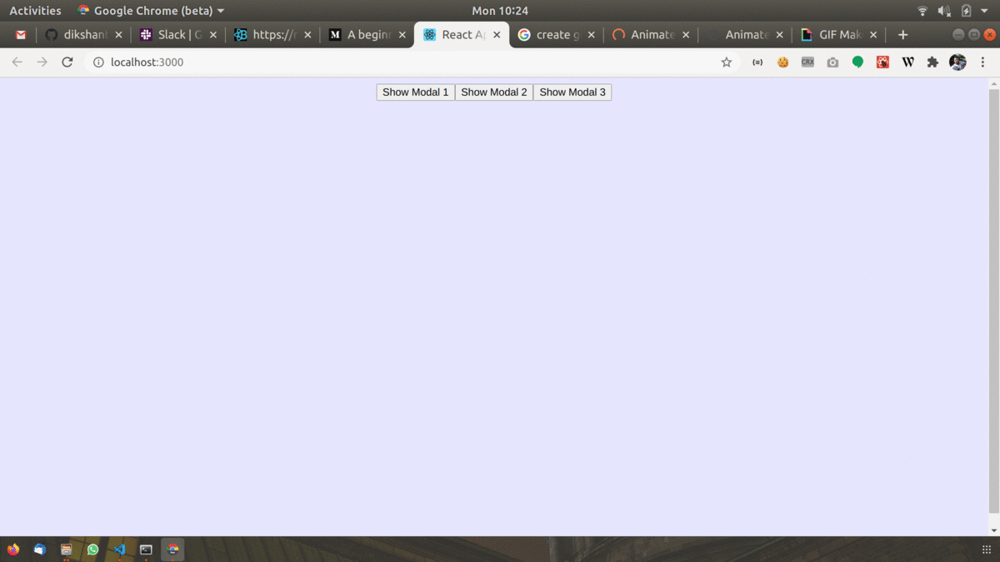

# react-modal-with-web-accessibility
React Modal Library helps user with Web Accessibility

## Features:

- Header (May contains Title of PopUp and cross icon at right side)
- Body (May contains content of PopUp)
- Footer (May contains Buttons like: Disagree, Agree etc)
- Cross Icon to close Pop Up
- Escape Key (`ESC`) to close Pop Up
- Tab Key (`Tab`) to focus first focusable item (first time)
- Tab Key to focus on next focusable item (if already have focus on any item)
- Shift + Tab (`Shift + Tab`)keys to get focus on previous item
- PopUp Part should be Bright and Background area should be dull.
- Click outside the PopUp window should close PopUp.
- Background Scroll shouldn't work when PopUp opened
- PopUp content should be scrollable.
- Min and Max height width.
- Should have decent view in Mobile.

### Preview 

